# Robot Learning for Planning and Control

Author : [Harikrishnan Seetharaman](https://github.com/HariKrishnan06082k)

The repository comprises several projects focusing on the control and motion planning for robot manipulation. The covered topics are outlined below.

* ✅ Regression for Forward Kinematics
* ✅ Finite Horizon LQR Control using Least Squares and with constraints
* ✅ Infinite Horizon LQR Control
* ✅ MPPI Controller
* ✅ Learning Uncertain Dynamics of Panda Manipulator
* ✅ Gaussian Process Fitting using GPytorch
* ✅ Learning from Images (VAE and autoencoder based approach)

## Regression for Forward Kinematics of 3-link manipulator

The code implements a class called `GeneralNN` which is a 3 fully-connected layers with hidden sizes 100 and Tanh activations. This is to show that NN is also capable of approximating general functions without the need of a set of basis functions.

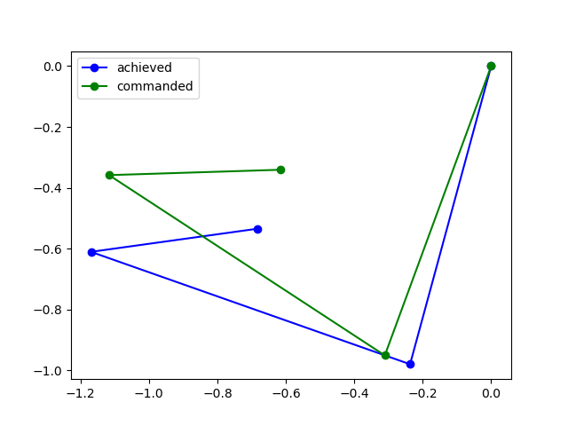

## Trajectory Planning With MPPI Controller.
MPPI (Model Predictive Path Integral Control) is a robust control method used for robotic manipulation, particularly suited for tasks requiring precise and dynamic control, such as grasping and manipulation.
It is a type of model predictive control (MPC) where the controller predicts the future behavior of the system based on a dynamic model. It iteratively optimizes control inputs over a finite time horizon to achieve desired objectives while considering system dynamics and constraints.
It incorporates path integral techniques to compute control signals. It formulates control as a path integral over the control space, enabling the controller to explore a wide range of control strategies and adapt to uncertainties.

An implementation is carried out for Panda pushing arm to reach the desired configuration in the Pybullet simulator.

Other linear control methods are also explored (LQR with least squares), (Shooting Vs Collocation)

---

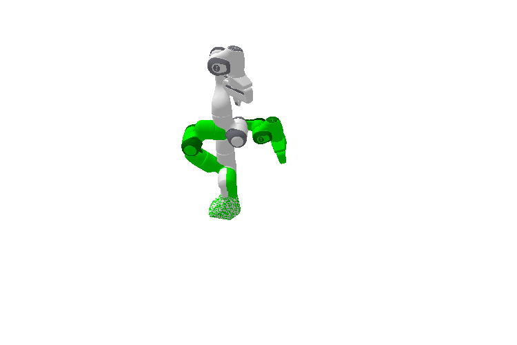

---

## Gaussian Process Kernels
A Gaussian Process (GP) is a stochastic process commonly used in Bayesian non-parametrics, whose finite collection of random variables follow a multivariate Gaussian distribution. GPs are fully defined by a mean and covariance function. They can be used to do regression and classification as well.

The aim is then to fit a posterior over functions. GPs allow us to learn a distribution over functions given our observed data and predict unseen data with well-calibrated uncertainty, and is commonly used in Bayesian Optimization as a surrogate function to maximize an objective.

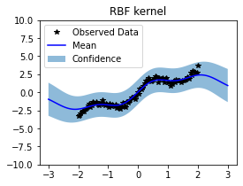

## Learning Uncertain Dynamics of Panda Manipulator when performing planar pushing

The state space consists of the cylinder's position on the table, represented as [x, y].

p (pushing location along the edge of the cylinder in radians) in the range [-0.25π, 0.25π].
ϕ (pushing angle) in the range [-π/2, π/2].
ℓ (pushing length as a fraction of the maximum pushing length) in the range [0, 1]. The maximum pushing length is 0.1 m.

The task assumes quasi-static conditions, where pushing actions are slow enough that cylinder velocity and inertia are negligible.
There's a small amount of noise on the applied action in the simulator, introducing randomness into the dynamics.

---

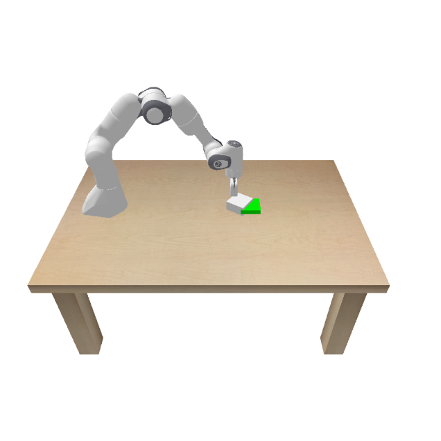

---

## Learning Uncertain Dynamics of Panda Manipulator when performing planar pushing

Planar Pushing task learned directly from images rather than having discrete state space information.

---

### Collecting Dataset

The data collection requires rendering images, generating a decent size dataset may take some time. To avoid unnecessary waiting time, a small subset of data is collected. Here our state space becomes the sequence of images collection in one trajectory itself. Refer the figure below.

---

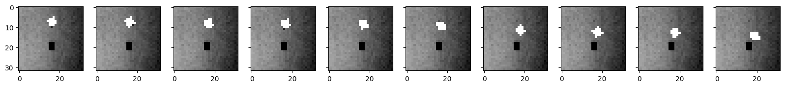

---
### Training VAE on the images

A VAE Encoder which maps images to Gaussian Distribution over latent vector is implemented.

The Decoder then takes in the `latent_dim` and performs the reconstruction of the input image.

**Note:** The VAE model was trained using a single GPU for demonstration purposes. For training on larger datasets, it would be recommended to use multiple GPUs or distributed computing technologies
The dynamics of the model is not considered yet here. The architecture of state encoder is as below.

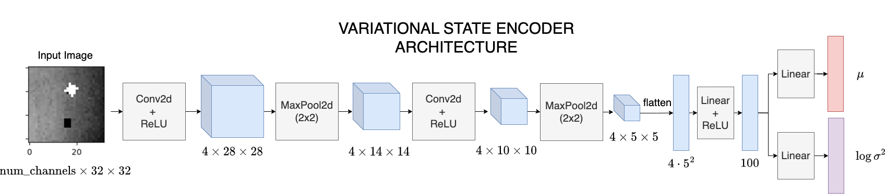

---

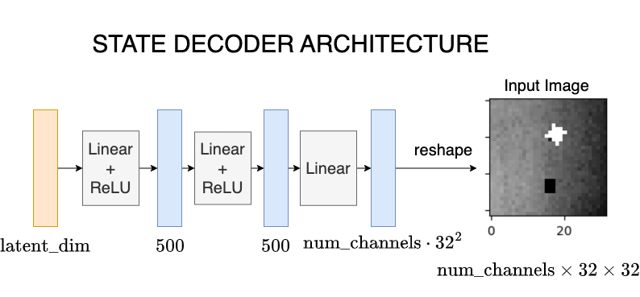

---

After the model is trained you should expect to see a near-perfect reconstruction as the network is able to memorize every single state.

---

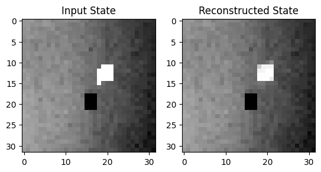

---

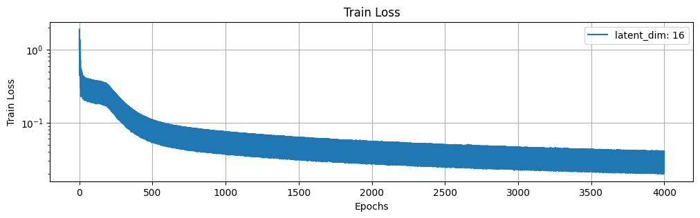

---

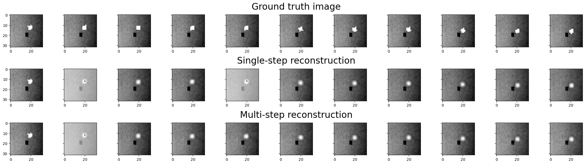

---

### Learning Latent Dynamics

A simplified version of Embed to Control (E2C) was implemented using a simple autoencoder and the dynamics is learned in the latent space of the autoencoder.

---

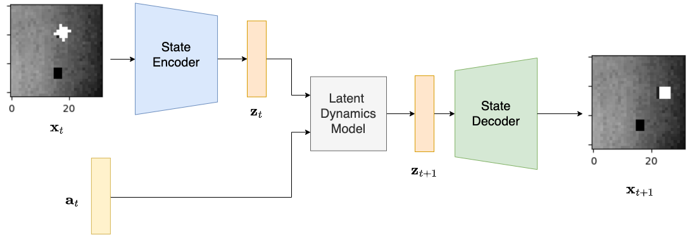

---

### Image Space and Latent Space Controller

* ✅ MPPI was implemented to 
propagate the dynamics in image space where the cost associated was also in image space. 

* ✅ MPPI will propagate the dyanamics in the latent space. Moreover, the cost function will be formulated in latent space, comparing how close states are to the goal in latent space.

---